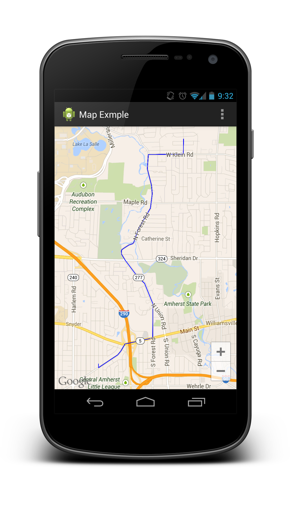

MapNavigator
============

Easy to use library to get and display driving directions on Google Maps v2 in Android. This library gives you directions
and displays the route on the map.

Only works with Google Maps v2

Usage
=====

    GoogleMap map = getMap();
    Navigator nav = new Navigator(map,start,end);
    nav.findDirections(true, false);
    
Path displayed callbacks
========================

Sometimes you may need to know when the path is finished being displayed so you can show all the different route segments
in a listview or something.

Simple just implement the onPathSetListener

    nav.setOnPathSetListener(this);
    
make sure your fragment or activity implements the interface OnPathSetListener then implement onPathSetListenerand you will get 
the callback when the path is ready

Important Notices
=================

As per Google's TOS using this library to supply turn-by-turn directions is strictly prohibited

    Google Maps/Google Earth APIs Terms of Service
 
    Last updated: May 27, 2009
    ...
    10. License Restrictions. Except as expressly permitted under the Terms, or unless you
    have received prior written authorization from Google (or, as applicable, from the
    provider of particular Content), Google's licenses above are subject to your adherence
    to all of the restrictions below. Except as explicitly permitted in Section 7 or the
    Maps APIs Documentation, you must not (nor may you permit anyone else to):
    ...
    10.9 use the Service or Content with any products, systems, or applications for or in
    connection with:
 
    (a) real time navigation or route guidance, including but not limited to turn-by-turn
    route guidance that is synchronized to the position of a user's sensor-enabled device;
 
    and may be disabled for certain apps (somehow, at least on Android)... FromGeocode
    scraping in .NET conversation:
    This is not allowed by the API terms of use. You should not scrape Google Maps to
    generate geocodes. We will block services that do automated queries of our servers.
 
    Bret Taylor
    Product Manager, Google Maps
    
You also only get 2,500 requests/day, more for business customers

    The Directions API has the following limits in place:

    2,500 directions requests per day.
    When the mode of transportation is driving, walking, or cycling, each directions search counts as a single request.
    Searching for transit directions counts as 4 requests.
    Individual requests for driving, walking, or cycling directions may contain up to 8 intermediate waypoints in the request. Waypoints can not be specified for transit requests.
    Google Maps API for Business customers have higher limits:

    100,000 directions requests per day.
    23 waypoints allowed in each request. Waypoints are not available for transit directions.
    
